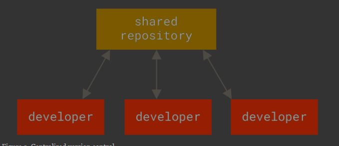

# Version Control

#git
## sebelum ada version control
dulu sebelum ada version control, contoh saat kita membuat document, code, atau apapun tugas pada computer kita
saat ada versi yang baru / revisi dari document sebelum nya kita akan membuat dengan nama yang berbeda

contoh
saat kita membuat document , skripsi,
kita membuat nama dengan *bab1*, jika ada revisi baru dan kita ingin menyimpan file yang lama maka kita akan membuat dengan nama baru contoh *bab1_revisi*, lalu jika ada revisi lagi atau sudah fix kita akan membuat dengan nama baru lagi *bab1_final*
sehingga akan membuat banyak file

mengapa kita lakukan hal tersebut?, agar kita tau atau ada histori dari file yang awal, lalu file yang revisi, lalu file yang sudah fix

dan kita bisa menggunakan file yang sebelum nya jika file tersebut di perlukan

## version control

- adalah sebuah system yang merekam semua aktivitas suatu file dari waktu ke waktu, sehingga kita bisa melihat setiap perubahan di mana perubahan itu terjadi berdasarkan waktu nya
- version control sangat populer di kalangan programmer, karena mereka menulis code program dalam bentuk code tulisan,  dengan version control programmer dapat merekam semua perbuhan code program yang di tulisnya, sehingga jika ada error dapat kembali lagi ke keadaan seblunya, atau dapat melihat code berdasarkan waktu yang di rekam
- version control tidak hanya bekerja dalam bentuk teks, dalam file apa pun version control dapat merekam setiap perubahan, dari file gambar atau layout atau apapun, version control dapat di gunakan oleh semua kalangan, seperti designer / editor yang menggunakan file extension photosop / .psd, atau .pdf, jpg dan lainya

> ***version control dapat di gunakan oleh semua kalangan*** 
## tipe-tipe version control

beberapa tipe dari version control

1. local version control
2. centralize version control
3. distributed version control (D-VCS)

### 1. local version control
adalah jenis version control yang berada pada local computer kita
version control jenis ini hanya mengelola file di dalam komputer itu sendiri
kelemahan jika rusak dan tidak ada back up maka semua akan hilang , serta sulit untuk melakukan colaborasi secara team

#### diagram local version control

### 2. centralize version control
adalah jenis version control yang terpusat , atau berada di dalam server, ini memungkinkan kita dapat bekerja secara team

kelemahan, jika server down maka semua dari team tidak dapat mengakses file  

#### diagram centralize version control

### 3. distributed version control (DVCS)
distributed version control atau DVCS adalah alternatif dari centralize version control, dimana kita bisa menyimpan repository di dalam server dan kita dapat mengambilnya lalu bekerja secara mandiri di local komputer kita masing masing

bahkan dalam satu DVCS dapat menggunakan lebih dari satu server untuk 
contoh dari DVCS ini adalah , mercurial , Git

#### diagram distributed version control
