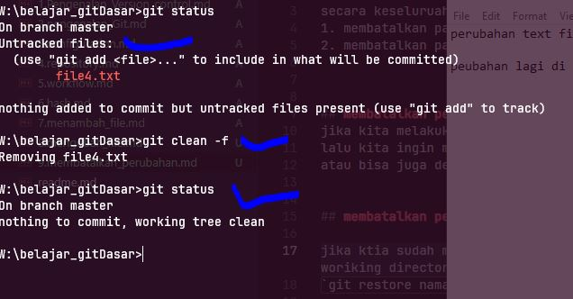
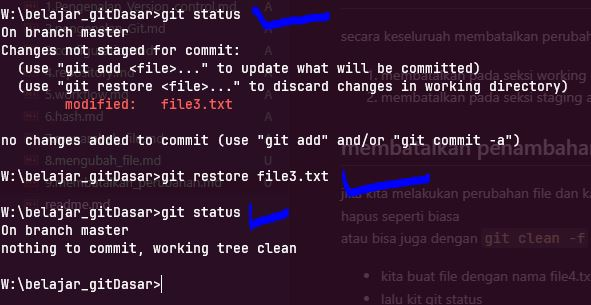
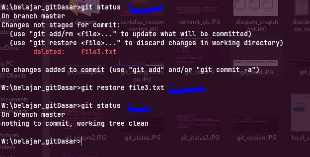
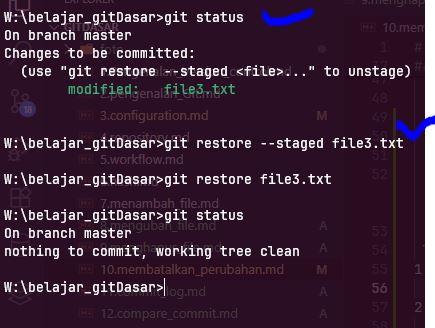

# membatalkan perubahan

secara keseluruah membatalkan perubahan file pada git terbagi menjadi 3 berdasarkan seksi areanya
1. membatalkan pada seksi working directory
2. membatalkan pada seksi staging area

## membatalkan penambahan file
jika kita melakukan perubahan file dan kasus ini kita menambahkan file dan posisi nya masih untrack file
lalu kita ingin menhapus file nya cukup hapus seperti biasa  
atau bisa juga dengan `git clean -f`
dalam contoh 
- kita buat file dengan nama file4.txt
- lalu kit git status
- lalu jalankan `git clean -f`  
  
  

## membatalkan perubahan file

jika ktia sudah melakukan perubahan pada sebuah file lalu kia ingin membatalkan nya dan posisi masih di woriking directory, kita cukup dengan   
`git restore namafile`

dalam contoh ini 
- kita membuat perubahan (bebas menambah text atau menghapus text) pada file3, lalu di simpan
- lalu kita batalkan dengan `git restore file3.txt`
- lalu kita cek lagi git status
  
    

  maka isi file akan kembali seperti terakhir sebelum nya

## membatalkan penghapusan file

membatalkan penghapusan file, saam seperti membatalkan perubahan file, kita cukup menjalankan kode  
`git restore namafile` , maka file yang di hapus tadi akan kembali lagi

dalam contoh ini 
- kita akan menghapus file3
- lalu kita git status melihat status nya
- lalu me restorenya kembali
- silahkan cek kemabli file nya sudah ada lagi
  
  

  ## membatalkan dari staging index
  git restore hanya bisa di lakukan jika perubahan masih berada di `working directory`, jika kita sudah terlanjur memasukan di `staging index`, kita tidak bisa lagi langsung melakukan restore, kita harus mengembalikan terlebih dahulu dari staging index ke working directory  
 
 langkah nya 
1. kita harus mengembalikan dari stagging index ke working directory
    `git restore --staged namafile`
2. setelah berada di woriking directory baru kita lakukan restore 
    `git resotre namafile`  
    
    
***git restore ke woring directory***  

  

## membatalkan yang sudah di commit

bagaimana jika perubahan yang sudah terlanjur di commit?
tidak ada cara lain untuk membatalkan yang sudah di commit,
yang bisa kita lakukan hanya dengan   Rollback Commit` atau `Revert Commit`
ini akan di bahas di materi tersendiri