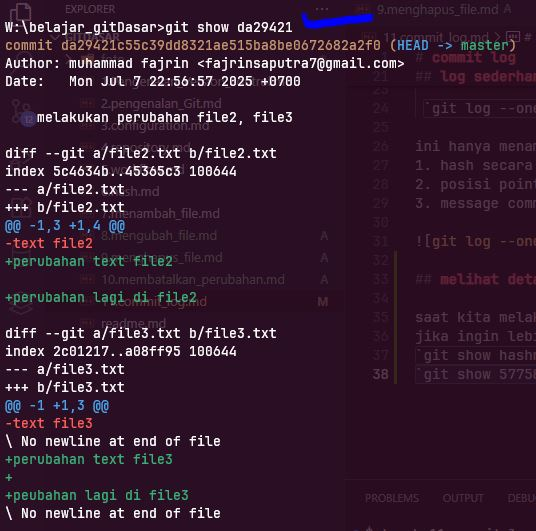

# commit log

- kita sudah mengetahui Git adalah distributed version control, yang artinya kita bisa mengerjakan / mengambil file dari server dan local computer kita
- semakin banyak commit maka repository akan semakin besar ukuran nya
- dan kita bisa melihat semua snapshoot dari setiap commit yang sudah di lakukan

untuk dapat melihat hasil dari commit atau aktivitas dari commit yang sudah pernah kita buat kita bisa menjalankan perintah  
`git log `

maka akan tampil beberapa inforamsi diantaranya
1. commit hash
2. author (orang yang melakuakn commit)
3. date , waktu commit di buat
4. message commit, adalah pesan / keterangan yang di tulis dalam commit

  

dari foto di atas terdapat beberpa baris dari sebuah setiap commit

## log sederhana
kita juga bisa menampilkan log secara sederhana cukup menambahkan option `--oneline` yang artinya satu baris    , pada git log tadi seperti berikut

 `git log --oneline`

ini hanya menampilkan  
1. hash secara singkat, hanya beberapa karakter awal nomor hash nya
2. posisi pointer branch nya
3. message commit nya

## melihat detail commit

saat kita melakukan commit log , yang di tampilkan hanya informasi berupa author, date dan waktu  
jika ingin lebih detail, terhadap file apa saja yang terjadi bisa menggunakan perintah  
`git show hashnya` contoh  
`git show 57758`  

## graph

saat kita bekerja dengan git dan melakukan kolaborasi maka akan banyak tampil alur , dari coomit yang merging, rebase dll, ini akan membentuk sebuah graph
semakin komplek dan banyak branch nya maka graph nya juga akan semakin banyak

untuk melihat grap nya bisa dengan kode  

`git log --graph` atau bisa juga dengan `git log --oneline --graph`, 

