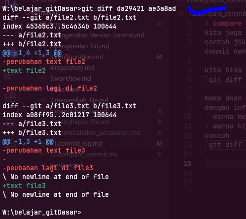
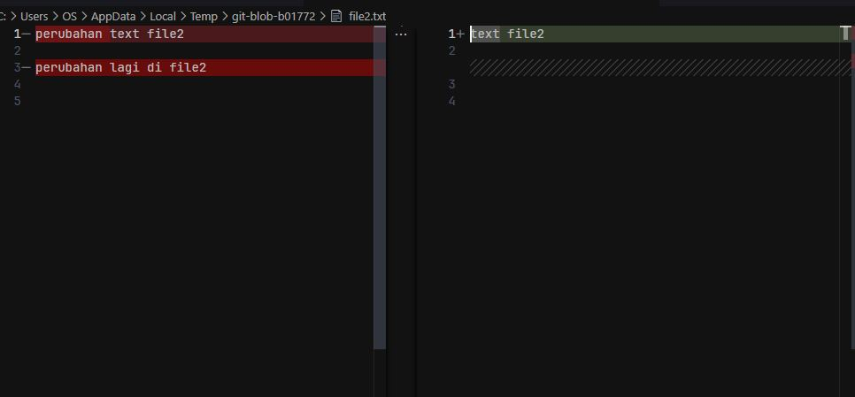

# compare commit
kita juga bisa membandingkan antara commit yang satu dengan yang lain  
contoh jika kita ingin membandingkan / ingin melihat perubahan apa saja yang terjadi dan perbedaan pada commit dengan hash 1 , dan hash 2

kita bisa menggunakan perintah  
`git diff nmorHash nomorHashPembanding` 

maka akan tampil perbandingan nya di terminal kita 
dengan informasi 
- warna merah tanda (-) adalah baris/ atau file yang di hapus
- warna hijau tanda (+) adalah baaik itu baris/ file yang di tambah
contoh  
`git diff 984736 209484`  

***git diff***  

## diftool

sebelumnya kita sudah membahas sedikit difftool di configurasi  
ini bisa kita gunakan agar kita bisa melihat perbandingan ny di code editor (dalam contoh ini vscode, karena kita sudah seeting di vscode saat di configurasi)
caranya cukup jalankan kode  
`git difftool hashcode hascodepemabnding`  
contoh

`git difftool 984736 209484`

>note saat di jalankan ada perintah y/n (yest/no), y jika lanjut dan n jikat batal

***difftool visual studio***

