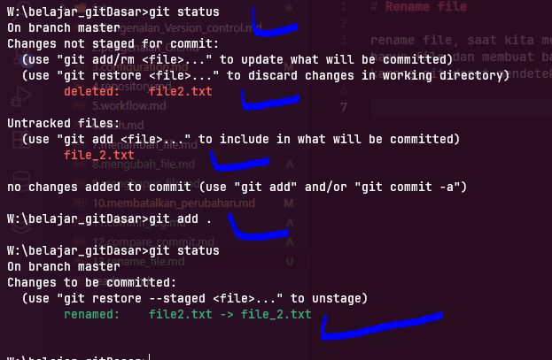

# Rename file

rename file, saat kita melakukan rename file secara tak langsung ini menjalanakn dua operasi dari git yaitu  
hapus file dan membuat baru, tetapi git dapat mengetahui itu  
karena git dapat mendeteksi jika isi keseluruhan sama, hanya mengubah namafile  

pada contoh ini kita akan mencoba mengganti nama file,
- dari yang nama nya file2.txt ke file_2.txt
- lalu kita kita add ke staging index

keterangan nya menjadi **renamed**
