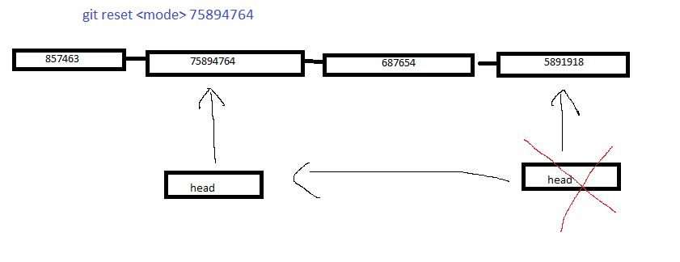
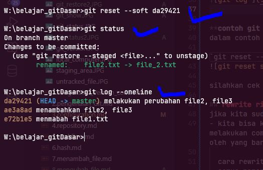
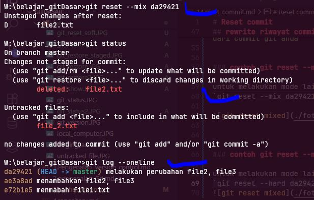
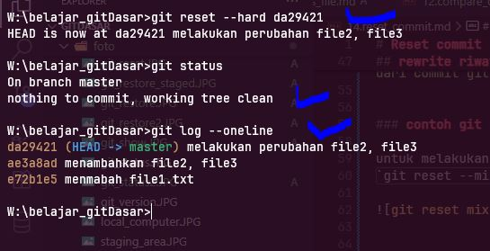

# Reset commit

sebelumnya sudah kita bahas bagaimana jika perubahan telah kita commit, kita tidak bisa membatalkan,  
tapi kita bisa melakukan *reset commit*, terhadap commit yang add
- reset commit adalah mekanisme merubah / mengeser posisi pointer *HEAD* ke commit yang kita inginkan

**Diagram Git Reset**

- untuk melakukan reset commit cukup jalankan perintah `git reset modenya nomorHash`
- untuk mode ada beberapa, yang umum di gunakan ada 3
  1. mode soft
  2. mode mix
  3. mode hard
   
## mode git reset

### 1. mode soft
--soft, dimana mekanisme ini hanya memindahakan HEAD, dan tidak merubah semua file yang ada di staging index dan woriking directory 

### 2. mode mix
--mix, ini adalah mode default saat kita melakukan reset, mode ini mekanisme nya, memindahkan head, dan mengubah / mengahpus file di staging area sama seperti kondisi awal repository pada head ini, namun tidak mengubah file yang ada di working directory

### 3.mode hard
--hard, mode ini adalah memindahkan HEAD pointer, dan mengubah file di stagging inde, dan di working di rectory sama seperti kondisi reposaat ini atau secara singkat nya menghapus semua file menjadi kosing di staging area dan working directory

jadi kesimpulan untuk dari beberapa diatas , yang paling aman itu adalah soft mode, dan yang paling bersih dan menghapus semua file yaitu mode hard
> note: gunakan mode susuai keperluan

>note : baiknya sebelum kita mereset catat / salin semua commit log, agar mudah / ingat nomor hash  

**git log**  

  

### **contoh git reset --soft**
dalam contoh ini kita melakukan git reset --soft  
`git reset --soft da29421`  
  

silahkan cek dengan git log, maka posisi pointer head telah beruabah

## rewrite riwayat commit
jika kita sudah melakukan reset ke suatu commit , apakah bisa kembali lagi?  
- kita bisa kembali lagi ke posisi sebelum reset, dengan syarat saat kita melakukan reset commit, kita belum melakukan commit baru, karena jika kita melakukan commit baru maka semua commit yang hilang akan di replace oleh yang baru / di timpa
  
  cara rewrite, cukup kita ulangi reset nya ke hash yang diawal td , maka dari itu penting kita menyalin semua nomor has ny / riwayat has nya agar tidak lupa
  
  `git reset --soft 1e8c5d2` dalam contoh ini nomor hash 1e8c5d2, 
>note nomor hash setiap komputer beda, jadi jangan terpaku dengan materi ini, pastikan masukan nomor hash dari commit git anda

### contoh git reset --mixed

untuk melakukan mode lain cara nya sama hanya mode nya saja berbeda  
`git reset --mix da29421`  

perhatikan gambar, mix hanya menghapus repository, perubahan di staging index, untuk file yang di working directory tidak di hapus

### contoh git reset --mixed

untuk melakukan mode lain cara nya sama hanya mode nya saja berbeda  
`git reset --hard da29421`  

perhatikan gambar, hard menghapus repository , dan semua file di staging index dan juga di working directory, semua sama seperti kondisi head saat inigit / secara singkat nya menghapus semua