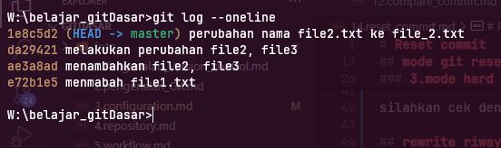
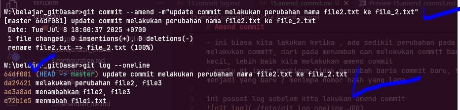

# Amend commit

adalah suatu cara merubah commit terakhir, tampa harus menambah commit baru  

- ini biasa kita lakukan ketika , ada sedikit perubahan pada suatu file atau merubah pesan commit nya, atau sesuatu tertinggal saat kita melakukan commit, dari pada menambah dan melekukan commit baru atau melakukan reset commit hanya untuk hal kecil , lebih baik kita melakukan amend commit
- perlu di ingat meskipun tidak menambah baris commit baru, tetapi amend commit ini, merubah nomor hast menjadi yang baru / menimpa nomor hash yang lama

ini pososi log sebelum kita lakukan amend commit  
  

cara melakukan amend commit  sama seperti commit biasa , hanya saja menambahkan optioan --amend  

`git commit --amend -m'pesan komit'  

ini kita setelah melakukan amend commit  

  

perhatikan gambar , bandingkan dengan gambar sebelumnya, jumlah commit tetap sama dan yang hanya beruabah pesan commit dan nomor hash pada head nya yang berubah

tugas  
1. buat sebuh file lalu commit 
2. ubah file tersebut (apapun yang igin di ubah)
3. lalu commit ulang dengan `git commit --amend `