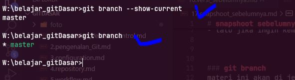
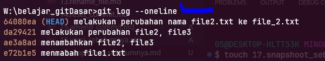
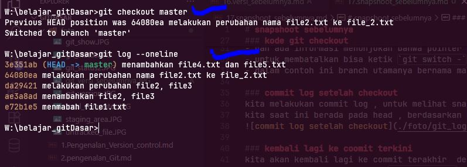

# snapshoot sebelumnya

- ini adalah fitur utama git , git seperti mesin waktu, - 
- jadi jika kita sudah memiliki beberpa commit snapshoot  
- kita kembali ke snapshoowt yang kita inginkan  , dan kita bisa melihat semua file pada snapshoot tersebut kondisi seperti apa
- cara nya " git checkout nomorHas "
- lalu jika ingin kembali ke head awal / commit terakhir ketikan " git check out namabranch "

### git branch
materi ini akan di jelaskan pada materi kusus
branch pada git adalah suatu cabamg, git dapat memiliki lebih dari satu branch  

untuk melihat branch saat ini 
- `git branch --shwo-current  
- atau bisa juga `git branch`

>note: secara default branch utama pada git akan diberikan nama *master* atau *main* tergantung dari komputer utama

### kode manampilkan branch
terdapat dua cara silahkan gunakan salah satu  
  

### kode git checkout

- dari gambar di atas kita melakukan git log terlebih dahulu untuk melihat snapshoot yang sudah ada
- lalu kita melakukan checkout ke hash kita inginkan  
- dan ada informasi menunjukan bahwa pointer head sekarang sudah berubah ke nomor hash  yang kita chekout td
- untuk membatalkan bisa ketik `git switch -` atau `git checkout master`  
- dalam contoh ini branch utamanya bernama master, jadi kita gunakan master

### commit log setelah checkout  
kita melakukan commit log , untuk melihat snapshoot   
kita saat ini berada pada head , berdasarkan nomor hash saat kita checkout td

### kembali lagi ke coomit terkini
kita akan kembali lagi ke commit terakhir  dengan cara   
untuk membatalkan bisa ketik `git switch -` atau `git checkout master`  

dalam contoh ini kita gunakan `git checkout master`
>note: karena di contoh ini bernama master, jadi gunakan master  
  

posisi head , dan commit sudah kembali ke snapshot terkini / paling baru