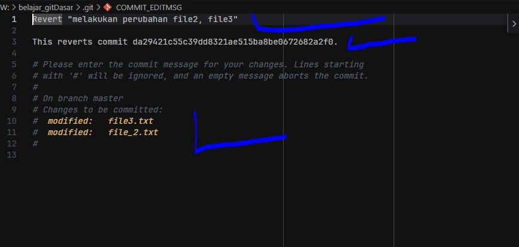
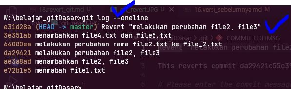

# Rivert Commit

- adalah suatu fitur di mana git membatalkan commit / dan mebalikan isi nya lalu membuat commit baru, tampa menghapus komit sebelumnya

### perbedaan reset dan revert

saat kita membatalkan sebuah commit dengan cara reset, maka git juga sekaligus menghapus semua commit yang ada seblumnya

berbeda dengan revert , rivert justru membuat commit baru tampa menghapus commit sebelumnya, dan mengembalikan / membalikan isi dari commit yang kita revert
contoh 

jika suatu file yang isi nya adalah perubahan dari a ke b, lalu kita revert maka commit baru terjadi adalah isi nya dari b ke a

### jadi yang mana yang lebih baik?
tergantung kondisi , jika menurut kita suatu commit seblum reset tidak penting ya kita reset sajs, maka  

tapi jika penting, dan jaga jaga jika di perlukan lagi lebih baik kita revert saja , karena tidak ada menghapus commit yang lain

### cara melakukan revert

caranya cukup dengan  
`git revert nomorHas`  

contoh  
`git revert 8474563`  

misal kita akan melakuakn revert pada hash berikut 
pastikan kita cek dahulu dengan `git log` dan copy semua isi nya jaga-jaga mengingat nomor hashnya
  
pada gambar diatas kita mencatat dan akan merevert commit dengan nomor hash / chceksum da29421  

### git revert 
saat kita sudah menajalankan git revert tadi maka akan tampil / terbuka code editor kita  
dimana akan ada informasi  
1. pesan commit nya , bisa kita buat ( secara default akan tertulis revert)
2. nomor hash / chcek sum yang akan di revert
3. perubahan pada file apa saja yang terjadi

jika sudah oke silahkan save  

  

maka bila kita cek log akan ada commit baru  
  