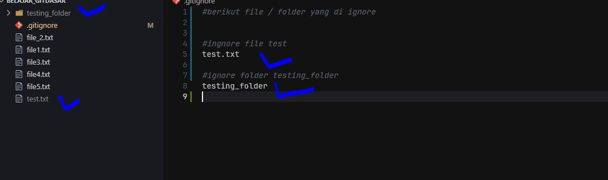
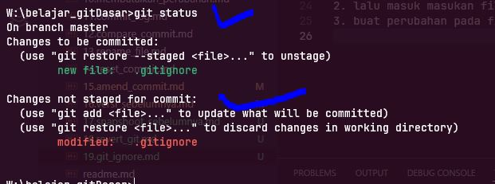

# git ignore

- secara default git akan melacak setiap perubahan file apapun, baik tu merubah, menambah atau mengahapus
- terkadang kita ingin ada file tertentu yang perubahan tidak ingin kita lacak, karena kita angap kurang penting, kita bisa melakukan nya dengan menggunakan `gitignore`
- dengan gitignore maka git akan mengabaikan perubahan apapun yang terjadi di file tersebut, karena git sudah mengabaikan nya  

## cara membuat git ignore  
caranya cukup buat sebuah file dengan nama `.gitignore`   
lalu kita bisa isikan nama file nya / folder yang ingin kita abaikan 

dalam contoh ini kita membuat `.gitignore`  lalu yang kita uji  
- nama file test.txt dan nama folder testing_folder  

maka apaun perubahan yang terjadi di dalam file test.txt tidak akan terlacak oleh git, begitupun pada folder test_folder , jika kita menambahkan file ke dalam folder tersebut maka file yang ada di dalam nya tidak akan terlacak oleh git, karena folder testing_folder sudah di masukan di dalam list gitignore  

>tips: jika banyak file yang ingin di ignore lebih baik buat folder kusus menampung file yang di ignore,masukan nama folder tersebut kedalam git ignore , selanjutnya  lalu masukan semua file yang ingin di ignore ke dalam folder tersebut

### file git ignore 

dari gambar diatas, yang di ignore adalah file dengan nama test.txt, dan folder yang bernama testing_folder.  
ciri file yang sudah masuk di ignore , biasanya warna nama file nya akan berubah agak redup
### status git ignore

dari gambar status di atas yang ada perubahan hanya file gitignore karena kita barus saja menambahkan file file dan folder yang ingin kita ignore ke dalam file git ignore  

sedangkan file test.txt dan folder_testing sudah tidak terlacak lagi

tugas 
1. silahkan buat file gitginore  
2. lalu masuk masukan file apa saja yang ingin di ignore
3. buat perubahan pada file tersebut, dan lihat apakan ada pada git log?  
