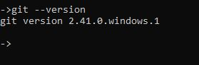

# Sejarah Git
- dahulu dalam perkembangan OS linux, mereka menggunakan patch dan archive file sebagai untuk updatenya
- dan mereke menggunakan dvcs pihak ketiga dengan nama beekeper, untuk memanage kode progam patch tersebut
- tapi pada tahun 2005 hubungan linux dan beekeper tidak baik, sehingga pendiri linux , yaiut  ***linus troval***, membuat dvcs (distributed version control) sendiri yang di berinama Git
- git sangat populer dan menjadi dvcs paling populer di dunia saat ini
- kelebihan nya git sangat ringan dan baik dalam memanage project dalam ukuran besar 


## pengenalan git
- jadi git adalah salah satu dari dvcs ,
git tidak perlu server, karena dalam memanage file , git dapat menduplikasi dan menanage nya, seperti melihat riwayat, commit repo dll  secara lokal juga ,jadi git bisa juga kita gunakan menjadi local version control
- setiap perubahan akan mendapat code tersendiri yang bersifat unik / signature menggunakan algoritma hasing SHA-1
- setiap perubahan akan di catat sehingga kita bisa menelusuri / kembali ke versi sebelumnya berdasarkan waktu / time line nya

## menginstal git
kita bisa mengunjungi ke website nya / repo nys 
silahkan donwload sesuai versi os nya 
berikut link nya [link download git](https://git-scm.com/downloads)


## memastikan git berjalan
setelah kita menginstal git kita cek melalui terminal 
``` git --version ```



maka akan tampil versio dari git yang kita download tadi
