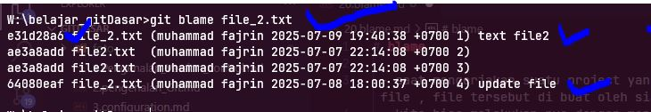

# blame

 - saat mengerjakan suatu project yang di kerjakan lebih dari satu orang, terkadang kita ingin melihat suatu file , file tersebut di buat oleh siapa dan apa saja yang terjadi di file tersebut 
 - kita bisa melakukan nya dengan menggunakan fitur git yaitu *git blame*  
 - cara nya cukup jalankan kode `git blame namfile` 
 - maka informasi dari file tersebut akan tampil   
  

  dalam contoh ini kita ingin melihat dari file_2.txt  
  `git blame file_2.txt`  
    

  beberapa informasi yang tampil dari git blame yaitu 
  - nomor hash nya / checksum nya
  - tanggal nya
  - apa saja perubahan nya
