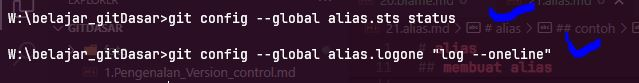
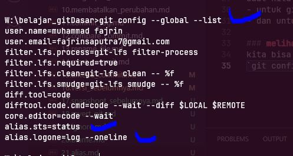
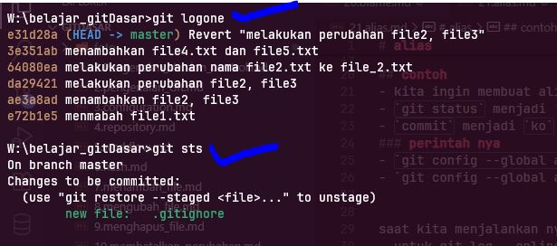

# alias

linux dan git dibuat oleh satu orang yang sama, jadi ada beberapa kesamaan diantranya alis  
di linux kita bisa membuat alias, atau semacam shorcut   

contoh jika ada perintah yang memerlukan code yang panjang bisa kita gunakan alias untuk mengganti nya dengan singkatan agar lebih mudah  

di git pun ada alias  

## membuat alias
membuat alias kita melakukan nya di configurasi git
format nya sebagai berikut  
`git config --global alias.namaAliasnya perintahnya`  
jika perintah lebih dari satu kata gunakan tanda kutip " 
`git config --global alias.namaAliasnya "perintahnya dua"`  

>note: dalam penulisan walau satu kata bisa menggunakn tanda kutip 2 atau tanpa tanda kutip 2, jika dua kata wajib menggunakan tanda kutip 2 

## contoh
- kita ingin membuat alias dari `git log --oneline` menjadi `logone`
- `git status` menjadi 'sts'
- `commit` menjadi `ko`
### perintah nya
- `git config --global alias.logone "log --oneline"`
- `git config --global alias.sts  "status"`

artinya dari kata *logone* itu merujuk ke *log --oneline*  , begitupun *sts* merujuk pada *status*

  

>note: dalam penulisan walau satu kata bisa menggunakn tanda kutip 2 atau tanpa tanda kutip 2, jika dua kata wajib menggunakan tanda kutip 2 

### melihat config alias  
kita bisa melihat di list config apa saja yang sudah kita buat alias nya  
`git config --global --list` atau `git config --global --show-origin --list`

  

### saat kita menjalankan nya   
- untuk git log --online, sekarang kita bisa menggunakan kode `git logone`
- dan untuk git status , sekarang kita bisa menggunakan kode `git sts`

