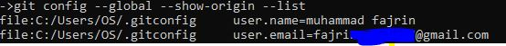
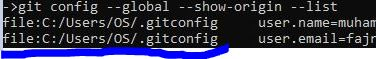

# configuration

setelah kita sudah menginstall Git, selanjut nya kita akan mengatur / mengconfigurasi git

beberapa hal yang penting yang wajib adalah `user name dan email `

dalam pengaturan ada 2 macam yaitu secara `global` dan secara `local`
- global artinya setiap configurasi yang kita lakukan berlaku secara gelobal terhadap komputer kita
- local artinya berlaku hanya pada folder tertentu di mana kita mensetup nya

di contoh ini kita akan mengconfig secara global

### mengatur user name dan email

cukup ketikan perintah berikut

**user name**  
`git config --global --add user.name "isi nama yang di inginkan" `; 

**email**  
`git config --global --add user.email "isi nama email yang di inginkan" `; 


**untuk melihat hasil nya**

`git config --global --list`  
atau jika ingin lengkap sekalin lokasi file ny

`git config --global --show-origin --list`  




untuk lebih lengkap ada option apa saja silahkan cek di help nya
`git config -help`

### menambahkan editor default

kita juga bisa menconfig code editor yang kita gunakan sebagai editor default,  
secara bawaan / default jika di windows maka akan menggunakan `notepad`,  
tapi kita bisa juga menggatur agar bisa menggunakan editor yang kita inginkan

dan juga bisa kita untuk `difftool`

***code setting core editor***
```cmd
git config --global core.editor "code --wait"
```
note: untuk option wait berguna hanya tambahan, jika kita ingin code editor tetap terbuka saat kita belum save, jadi tidak menggunakan option --wait juga tidak apa apa


***code setting untuk diff tool***
```
git config --global diff.tool vscode

git config --global difftool.vscode.cmd 'code --wait --diff $LOCAL $REMOTE

```


#### untuk melihat hasil

ini untuk melihat config full dengan path lokasi nya
```
git config --global --show-origin --list 
```


ini hanya untuk melihat config saja
```
git config --global --list 
```


### menghapus config

kita juga bisa menghapus, jika kita ingin menghapus di karenakan ada kesalah config  

1. menghapus properti tertentu
 contoh kita ingin menghapus email karena salah ketik

 code nya
 `git config [location] unset [variabelnya]`

 contoh

 `git config --global unser user.email`
 dari contoh di atas kita mengahapus variabel email 


2. menghapus full config

cukup delete file yang bernama `.gitconfig`, di dalam file ini tersimpan semua configurasi git kita secara gelobal 

untuk lokais file bisa kita lihat saat melihat hasil pengaturan dengan

```git config --global --show-origin --list```

maka kita bisa melihat lokasi file config nya, dalam contoh ini di  
`c:/Users/OS/.gitconfig` 




## beberapa action penting pada git config

kita bisa melihat ada option dan action apa saja pada git config dengan cara

```git config --global --help```


***add***
action ini di gunakan untuk menambahkan variabel

contoh
git config --global --add user.name "nama anda"


***unset***
action ini di gunakan untuk menghapus variabel
contoh
git config --global --unset user.email


masih banyak yang lain seperti `--replace, --replace-all, --get, --get-all`