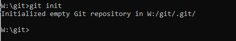
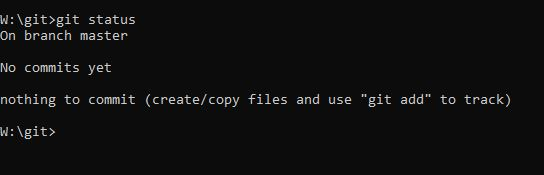

# Repository

di dalam terminologi atau istilah git, *repository* adalah folder project yang menyimpan semua file kita

untuk membuat repostiory, kita harus menentukan folder mana yang ingin kita buat 
- bisa dengan folder baru / atau kosong
- atau bisa juga dengan melakukan cloning dari repository yang sudah ada

## membuat repostiory
membuat repository cukup mudah dengan cara , ini kita akan melakukan cara dari awal / folder kosong
cukup dengan perintah 
`git init`;

dan pastikan kita melakukan nya di dalam folder yang ingin kita buat menjadi repository nya

, lalu cara lain yaitu dengan clone
`git clone alamat_repository_yang_ingin_kita_clone`
> note: untuk clone akan lebih detail di materi terpisah 

- setelah kita melakukan init, atau inisisapi , perhatikan di dalam folder tadi ada sebuah file dengan nama `.git` , pastikan file ini jangan di ganggu apa lagi di hapus, karena ini akan berisi database dari repository yang kita buat tadi

pastikan kita dapat melihat semua file karena secara default file tersebut tersembunyi
, untuk windos bisa diatur di view nya dan tampilkan semua (pengaturan hidden item nya)
, untuk terminal bash bisa menggunakan perintah `ll -all`;

## Git Status

git status adalah melihat status dari repo saat ini, apa yang sedang terjadi

***kode git status**
`git status`

 ***infor masi dalam git status***

 1. nama branch saat ini
 2. file yang ada di stage (warna hijau umumnya)  -> akan di jelaskan di materi selanjutnya
 3. file yang di woriking directory (warna merah) -> akan di jelaskan di materi selanjutnya
 4. untracked file (warna merah) -> akan di jelaskan di materi selanjutnya