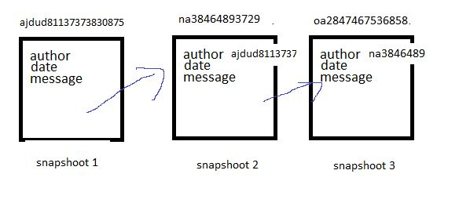
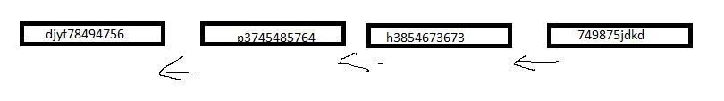

# hash

## snapsot
di materi sebelumnya kita menjelaskan  perubahan suatu file di simpan di repository, pada praktek nya kita bisa menyimpan setiap semua perubuhana lebih dari satu file kita simpan secara bersamaan , ini di sebut `snapshoot`

snapshot berisi setiap atau semua perubahan file yang di simpan di dalam satu committed, dan setiap snapshot akan mengahsilkan `hash`

## hash
- setiap snapshot yang di lakukan akan menghasilkan hash,
- hash adalah checksum untuk menghitung setiap perubahan yang terjadi 
- git menggunakan algoritma SHA-1 untuk menghitung hash
- hash di gunanakan untuk menjaga data integrity, sehingga setiap snapshot yang di lakukan hash nya tidak dapat di ubah , jika ini terjadi akan merusak hash secara keseluruhan
- contoh hash Git , `c0b93b72391d0b261ac1418c33ab90f2e21f9368`

## perhitungan hash
hash tidak hanya di lakukan di perubhan file, tetapi juga di lakukan di parent, author, massage
sehingga jika di lakukan perubahan maka akan mengakibat efek berantai
itu tidak bisa di lakukan oleh di git, inilah yang menjaga integrity data 

## Head
adalah pointer menuju hash paling akhir/terbaru
atau hash paling terbaru
karena jika kita ingin menuju ke hash paling baru, cukup sulit jika menulis semua karakter hasnya, jadi kita cukup menggunakan kata `Head`
