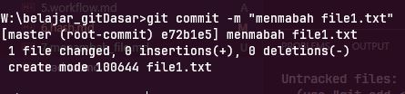

# Menambah file
- secara default saat kita menambahkan file yang sudah kita inisiasi ada git nya, file tersebut belum dapat di lacak atau `untracked`, dan berada di working directory,
- agar dapat di lacak setiap perubahan nya kita harus menambahkan nya dengan cara menulis kode `git add namafile`

***untracked***
> dalam contoh ini ,kita membuat terlebih dahulu sebuah file , lalu kita cek dengan git status untuk melihat posisi nya / status nya

dari foto diatas posisi file masih untracked file, artinya kita belum bisa melacak perubahan yang terjadi

selanjutnya kita menambahkn agar dapat di lacak dengan perintah `git add namafile`
dalam contoh ini  
`git add file1.txt`

atau jika banyak tedapat file dan kita ingin sekaligus memasukan ke dalam staging area bisa dengan  
`git add . `    menggunakan tanda . (titik)
maka semua perubahan yang ada di working directory akan masuk ke stagging area  

>note: perlu di ingat saat menulis nama file perhatikan path nya 

***memindahkan ke staging***  

***commited ke repository***
lalu di lanjutkan dengan melakukan commited ke repository (akan di bahas di materi lain)  
dengan cara

`git commit -m "pesan / keterangan commit"`

contoh

`git commit -m "manambahkan file1.txt"`  

## tugas

- tambah file2.txt lalu commite ke repository
- tambah file3.txt lalu commite ke repository
  