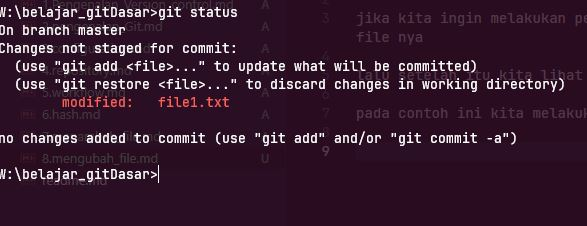
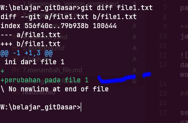

# mengubah file

jika kita ingin melakukan perubahan pada file, cukup lakukan seperti biasa apa yang ingin kita lakukan pada file nya  , lalu save

lalu setelah itu kita lihat git status untuk melihat status nya

pada contoh ini kita melakukan perubahn pada file1.txt , kita akan menambahkan text pada file nya

***git status***
jalan kan kode  `git status `  

  
dari gambar diatas setelah kia melakukan modifikasi / melakukan perubahan maka file1.txt akan berada lagi di working directori dengan keterangan `modified` artinya ada perubahan pada file1.txt

## melihat perubahan pada file

setalah sebelumnya kita melihat status nya ada perubahan, kita juga bisa melihat lebih detail perubahan apa yang terjadi pada file tersebut  
dengan cara menulis kode  ` git diff namafile`  
dalam contoh ini `git diff file1..txt`  
  
perhatikan keterangan diatas 
yang bertulis warna hijau dengan tanda 
`(+)` artinya penambahan text/gambar/kode
dan jika ada baris berwarna merah dengan tanda `(-)` artinya ada penghapusan 

dari contoah diatas terjadi perubahan yaitu penambahn baris text / code dan text perubahanya adalaah `penambahan pada file1`

## tugas

- commit file1.txt kerepository
- ubah file2, dan file3 lalu lalu lakukan commit juga